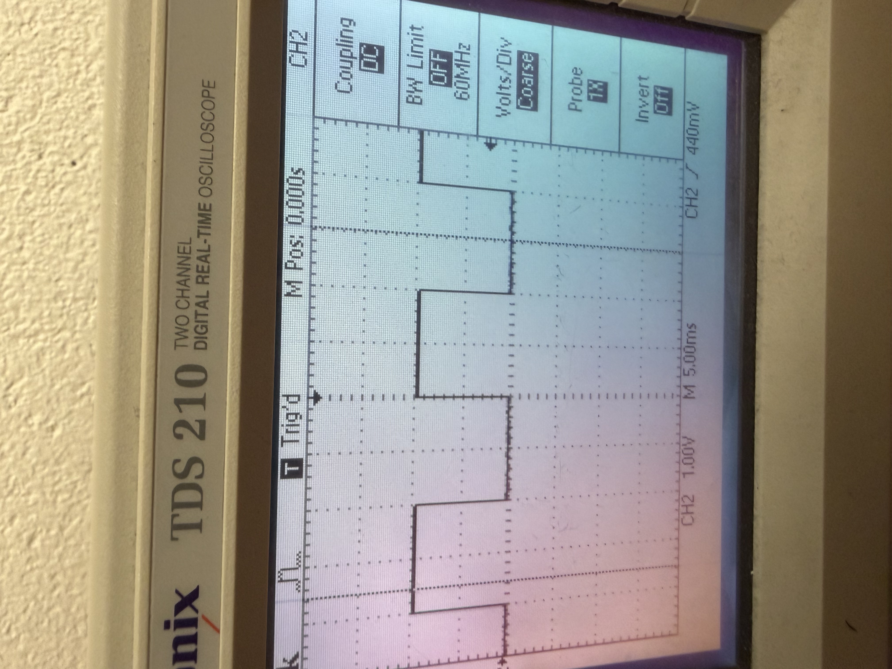

## A1 Evidence

## Team Members

- Josh Bub
- Eli Spielman

## Date

09/14/2026

## URL and Full Commit Hash

Repository: https://github.com/joshuabub-hub/PHY39A_repo.git

Commit: `a438fe5a65376d66d2ff01b27c197e30411df9a7`
## Apparatus

## Arduino Sketches

- [Blink.ino](Blink/Blink.ino)
- [AnalogReadSerial1.ino](AnalogReadSerial1/AnalogReadSerial1.ino)
- [Seq_Avg_volt_1.ino](Seq_Avg_volt_1/Seq_Avg_volt_1.ino)
  - Seq_Avg_volt_1 contains the code for parts 3B-4

## ADC Digitization Results

The results from the ADC digitization of our input voltage include a maximum ADC reading of 1,023, a minimum of 0, and a mid-point of ~511. Because our input voltage was 5 volts, the ADC readings have a resolution of about 5 millivolts. This resolution describes the discrete levels the ADC reading allows (steps of ~5 millivolts). Because the Arduino uses a digital chip, it can only approximate the continuous voltage changes the chip receives as input.

## Transition Between N=100 - N=1000

Before averaging kicks in, the unaveraged (sequential) readings visibly jump back and forth between two adjacent ADC codes (301 and 302) rather than settling on one value; this single-count toggling is the expected quantization behavior when the true input voltage sits right at the boundary between two discrete ADC levels. According to the 1/sqrt(1000) prediction, the standard deviation of our averaged voltages should be ~0.03 * the standard deviation of 100 sequential voltages. The standard deviation of our averaged voltages was only 0.5 times smaller than our sequential voltages standard deviation. While this ratio did change a bit as we continued running the sketch, it never dipped below ~0.2, which is less of an improvement than expected, but still significant.

<table>
<tr>
<th rowspan="2">Potentiometer block</th>
<th rowspan="2">Reported points</th>
<th rowspan="2">Readings averaged per point <em>N</em></th>
<th rowspan="2">Mean voltage</th>
<th colspan="2"><em>s</em> / <em>s</em>₁ (ratio to unaveraged)</th>
</tr>
<tr>
<th>Measured</th>
<th>Predicted</th>
</tr>
<tr>
<td>Unaveraged</td>
<td>100</td>
<td>1</td>
<td>301.65 mV</td>
<td>1</td>
<td>1</td>
</tr>
<tr>
<td>Long average</td>
<td>100</td>
<td>1000</td>
<td>301.9 mV</td>
<td>0.42</td>
<td>0.0316</td>
</tr>
</table>

## Measured Time for Analog Read

Arduino reported that we were performing the 1000 sample conversions in roughly 0.12 seconds. Averaging 1000 measurements improves our precision by smoothing the discrete jumps produced by converting the analog voltage signals to digital outputs. This smoothing is essentially a low-pass filter, as measurement results that occur faster than the time it takes to average will get blurred out.

## Oscilloscope Results

**Blink PWM Data**

| Measurement | Value |
| --- | ---: |
| Max voltage | 2 V *(probe was on the LED/resistor node, not pin 9 directly, so this is lower than the 5 V Arduino digitalWrite output)* |
| Min voltage | 0 V |
| Period | 20 ms |
| Duty cycle | 0.5 |
| Frequency | 50 Hz |

The oscilloscope shows all of the information about the PWM waveform. The Arduino Serial Monitor/Plotter only displays our ADC-converted voltage readings. To find the PWM frequency, duty cycle, and maximum/minimum voltages, we need the oscilloscope results. The oscilloscope reads raw, continuous electrical data, while the Arduino is reading, converting, and printing on some discrete timescale dictated by the sketch.

## Analog Input

Arduinos analog input measures the incoming voltage on a range of 0V - 5V, as opposed to digital input which just measures if it is 0V or if it is 5V. It does this by using an Analog to Digital Converter (ADC) which maps the 5V range of the arduino into 1024 smaller steps, and then returns the step that is closest to the voltage. For example if the analog pin recived 2.5V which is the midpoint of the range it would read out 512 as that is the midpoint of the 1024 range. One of the consiquences of this is that it takes more time to read out an analog signal, taking about 100µs per reading whereas digital can go much faster.

##  PWM Output

Arduinos can not output a true analog signal, they get around it by using a process known as Pulse Width Modulation (PWM). PWM is when the arduino rapidly cycles the power from 0V to 5V to a specific component much faster than the signal is being read from that component. This causes the observer or sensor to average out the readings and roughly see a component being powered by an analog voltage. The arduino can then vary this voltage by varying the duty cycle, which is the percentage of the time that the component recives 5V. For larger devices, like a motor, the arduino must then use these PWM controls to control another device which can operate at a higher current as the arduino itself cannot supply it. 

PWM is never true analog as if you were to read the voltage at a specific point it would always read near 0 or 5V.

