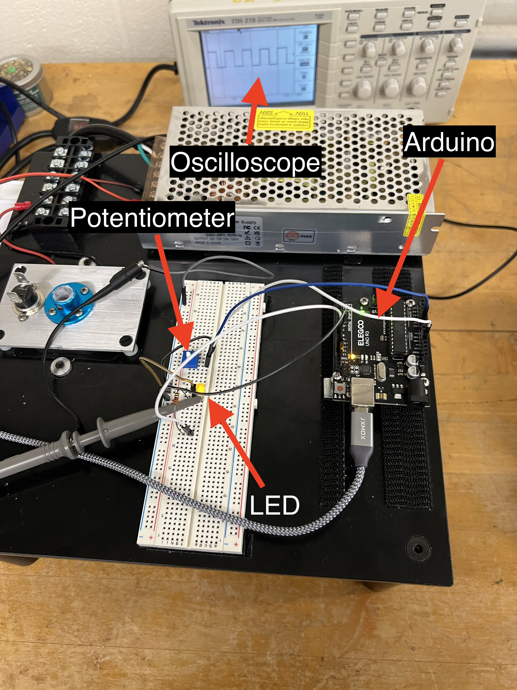
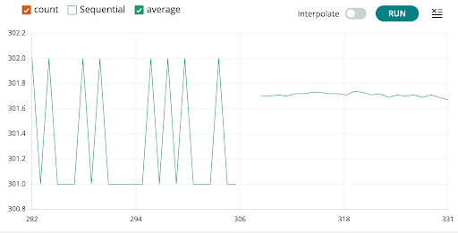
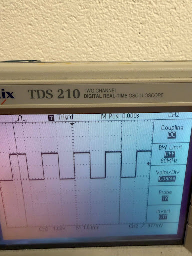

## A1 Evidence

## Team Members

- Josh Bub
- Eli Spielman

## Date

09/02/2026

## URL

https://github.com/joshuabub-hub/PHY39A_repo.git

## Apparatus

## Arduino Sketches

- [Blink.ino](Blink/Blink.ino)
- [AnalogReadSerial1.ino](AnalogReadSerial1/AnalogReadSerial1.ino)
- [Seq_Avg_volt_1.ino](Seq_Avg_volt_1/Seq_Avg_volt_1.ino)
  - Seq_Avg_volt_1 contains the code for parts 3B-4

## ADC Digitization Results

The results from the ADC digitization of our input voltage include a maximum ADC reading of 1,023, a minimum of 0, and a mid-point of ~511. Because our input voltage was 5 volts, the ADC readings have a resolution of about 5 millivolts. This resolution discribes the discrete levels the ADC reading allows (steps of ~5 millivolts). Because the Arduino uses a digital chip, it can only approximate the continuous voltage changes the chip recieves as input.

## Transition Between N=100 - N=1000

According to the 1/sqrt(1000) prediction, the standard deviation of our averaged voltages should be ~0.03 * the standard deviation of 100 sequential voltages. The standard deviation of our averaged voltages was only 0.5 times smaller than our sequential voltages standard deviation. While this ratio did change a bit as we continued running the sketch, it never dipped below ~0.2, which is less of an improvement then expected, but still significant.

## Measured Time for Analog Read

Arduino reported that we were performing the 1000 sample conversions in roughly 0.12 seconds. Averaging 1000 measurements improves our precision by smoothing the discrete jumps produce by converting the analog voltage signals to digital outputs. This smoothing is essentially a low pass filter, as measurement results that occur faster than the time it takes to average will get blurred out.
## Oscilloscope Results

